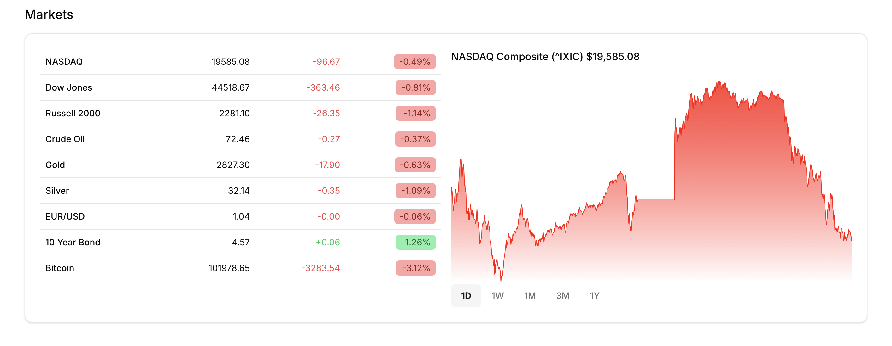

## InvestAssist: Stocks tracking app



## Key Features

- Robust Stock Search and Screening: Quickly find relevant stocks using intuitive search tools and apply filters based on key metrics.
- In-depth Company Information:
  - Real-time stock quotes and historical pricing data
  - Comprehensive financial statements (income statement, balance sheet, cash flow)
  - Key ratios and fundamental metrics
  - Detailed company profiles and summaries
- Interactive Charting Tools:
  - Customizable Visx area charts for visualizing market trends and patterns
  - Adjustable timeframes (intraday, daily, weekly, monthly, etc.)
- Market News Integration:
  - Curated feed of relevant news articles and analysis
  - Ability to filter news sources by relevance and sector

## Development Roadmap:

- Personalized stock watchlists
- Support for technical indicators (moving averages, Bollinger Bands, RSI, etc.)
- Dedicated news section
- User preferences and settings

## Technical Overview

Frontend: Next.js, React.js, TailwindCSS
Data Source: Yahoo-Finance2
Charting: Visx, d3.js
UI Components: Radix UI, Shadcn.

## Contributions and Feedback

If you have bug reports, feature suggestions, or want to get involved in development, please open an issue or submit a pull request.

## Getting Started

First, run the development server:

```bash
npm run dev
# or
yarn dev
# or
pnpm dev
# or
bun dev
```

Open [http://localhost:3000](http://localhost:3000) with your browser to see the result.

You can start editing the page by modifying `app/page.tsx`. The page auto-updates as you edit the file.

This project uses [`next/font`](https://nextjs.org/docs/basic-features/font-optimization) to automatically optimize and load Inter, a custom Google Font.

## Learn More

To learn more about Next.js, take a look at the following resources:

- [Next.js Documentation](https://nextjs.org/docs) - learn about Next.js features and API.
- [Learn Next.js](https://nextjs.org/learn) - an interactive Next.js tutorial.

You can check out [the Next.js GitHub repository](https://github.com/vercel/next.js/) - your feedback and contributions are welcome!

## Deploy on Vercel

The easiest way to deploy your Next.js app is to use the [Vercel Platform](https://vercel.com/new?utm_medium=default-template&filter=next.js&utm_source=create-next-app&utm_campaign=create-next-app-readme) from the creators of Next.js.

Check out our [Next.js deployment documentation](https://nextjs.org/docs/deployment) for more details.